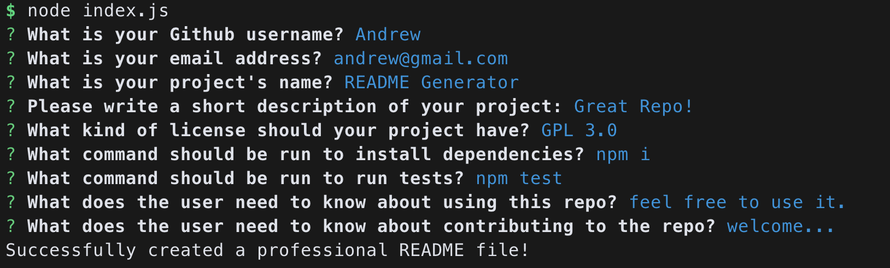
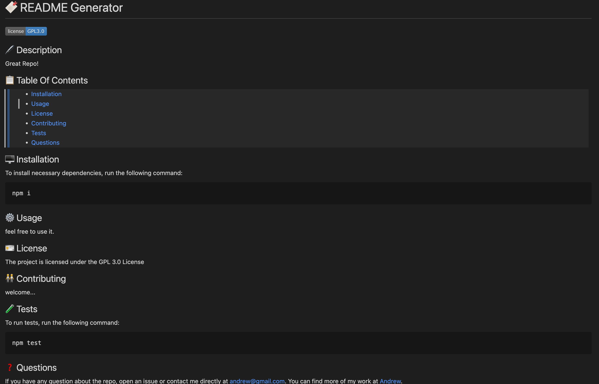

# Andrew's README Generator

## 🐳 Overview:
> * Automatically generate a README.md file (at sample folder)
>
> * Node.js application, use "npm i" to install dependencies. Then use "node index" to run the application
>
> * Using inquirer@8.2.4 & built-in fs package

> **Note**: Some prompted questions have defalut answers, type space to use the defalut value.  
>


## 🐯 Tutorial Video URL:
❗❗❗ ☛ [Clik Me To The Page!](https://drive.google.com/file/d/1YGLhAfYM7MCMeEJbgjtinuhXynmXpmbZ/view) ☚ ❗❗❗
```
https://drive.google.com/file/d/1YGLhAfYM7MCMeEJbgjtinuhXynmXpmbZ/view

(If the link is not working, please see the tutorial gif at the next section.)
```

## 🦊 Screenshots Of The Applications:

||
|:--:| 
| *Prompted questions* |

||
|:--:| 
| *Sample of the generated readme file* |

||
|:--:| 
| *Short tutorial* |
- - -
© 2023 edX Boot Camps LLC. Confidential and Proprietary. All Rights Reserved.
